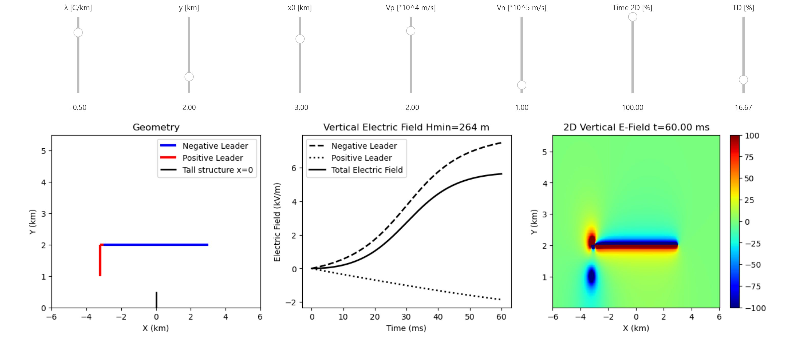

## On the Initiation of Upward Negative Lightning by Nearby Lightning Activity: An Analytical Approach
This is a webpage of repository accompanying paper [“On the Initiation of Upward Negative Lightning by Nearby Lightning Activity: An Analytical Approach”](https://www.agu.org/). Here you can find the source code directly on the location of [repository](https://github.com/IToni93/other_triggered_lightning_analytical).

## Graphical Interface
We have provided graphical interface to simulate four different scenarios discussed in paper and to obtain minimum height of tall structure for upward lightning to be initiated. User can access the interactive interface [here](). It may take few minutes to load the environment. Please don't forget to run the code of each cell to get interactive interface shown.

The interactive interface is Jupyter notebook executable environment, immediately reproducible.

Most of the input parameters can be changed trough this environment. In case user needs to make some other modifications or to use parts of this code please download the source code of the [repository](https://github.com/IToni93/other_triggered_lightning_analytical). There you can find both Python and Matlab versions of the code. Specific requirements to run python code in your local enviroment are given in requirements.txt file.

## Citation
Please use the DOI: "" of this paper and https://citation.crosscite.org/ to cite this paper in proper form.

APA format:
